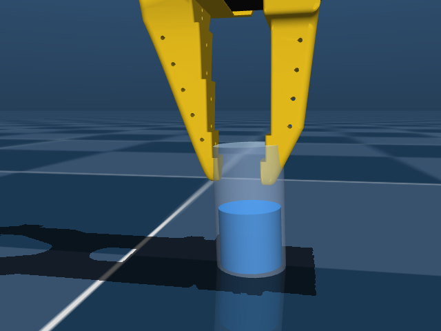
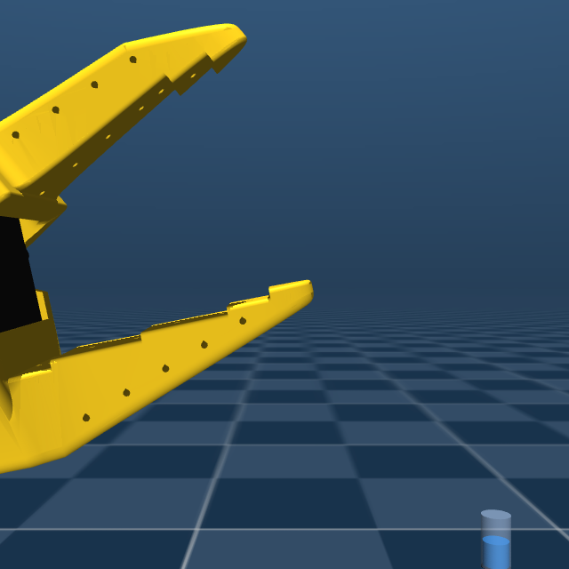
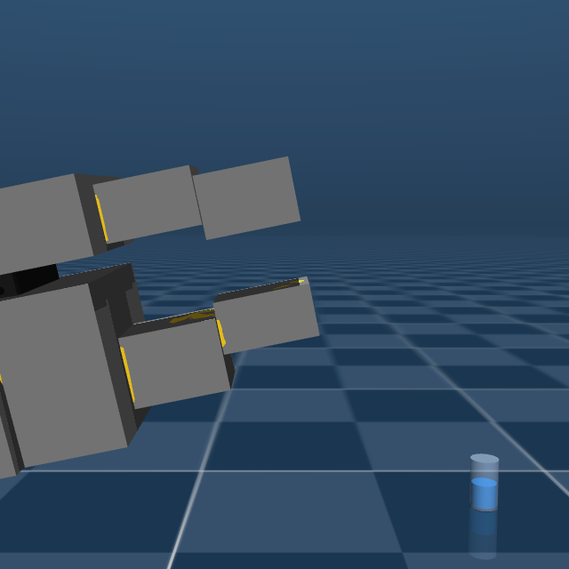
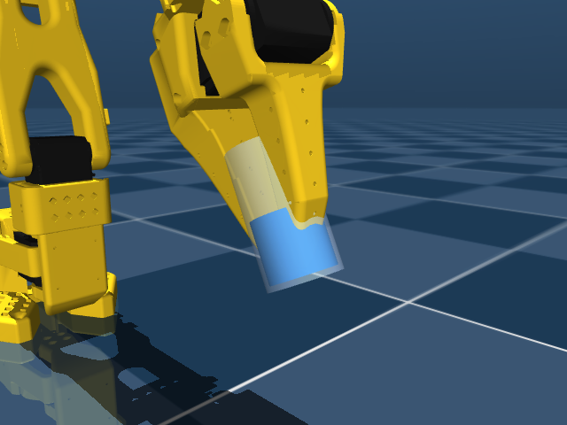
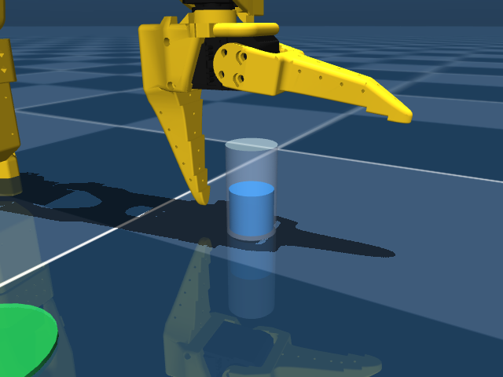
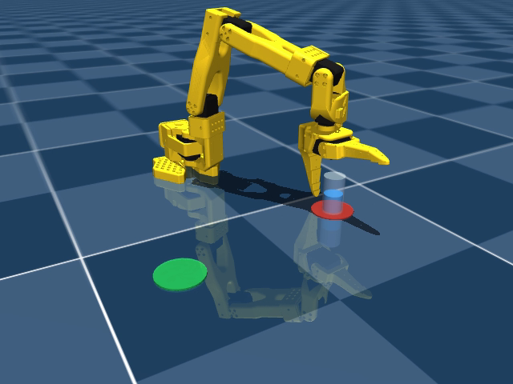

# The robot that couldn't pick up a glass — a sim2real debugging story

*How a $100 robot arm went from 5,000,000 training steps with **zero** successful grasps to
carrying a glass of water across the table — and every bug we squashed along the way.*

**The task:** an [SO-101 / SO-ARM100](https://github.com/TheRobotStudio/SO-ARM100) hobby
arm (six Feetech servos, MuJoCo simulation, PPO/SAC via Stable-Baselines3) must find a
glass of water standing on a **red** circle, pick it up, carry it — **without tilting it,
it's full of water** — and set it down upright on a **green** circle somewhere else.
Train in simulation, deploy on the real thing: classic sim2real.

Repo: **https://github.com/MarcelloMorettoni/sim2real**

---

## Act I: five million steps, zero grasps

The first full training run looked busy. The arm swept, poked, hovered… and in **40
evaluation episodes it never held the glass once**. Worse: in 62% of episodes it
*deliberately smacked the glass out of the workspace*.

Debugging RL is special because the policy will exploit any flaw you leave in the
world — so we stopped training and interrogated the world itself. A scripted grasp
(inverse kinematics, descend, close, lift — no learning involved) failed too, in
**250 out of 250 attempts**. That was the smoking gun: *the simulation itself couldn't
grasp.*

The contact log told the story: the glass was "penetrating" the gripper meshes by
19 mm — through empty air.

### Bug #1: the gripper's mouth was invisibly solid

MuJoCo collides mesh geometry as **convex hulls**. The SO-101 model reuses its concave
visual meshes for collision — and the convex hull of a C-shaped jaw *fills the mouth in*.
In collision space, our gripper had no opening at all. Nothing could ever be grasped.
It's invisible in the viewer, and no error is raised. The policy wasn't stupid;
physics was rigged against it.

**Fix:** at model load we disable collision on the two jaw meshes and rebuild them as
box "pads" fitted to the mesh vertices (via MuJoCo's `MjSpec`, keeping the vendored
model files pristine). The mouth becomes genuinely hollow:

And for the first time — a physical, stable, mid-air hold:

---

## Act II: the reward-hacking hall of shame

With physics fixed, the RL could finally learn — and it immediately taught us how
creative a policy can be about *not* doing the task. Every one of these actually
happened, each at millions of steps of scale:

1. **The suicide exploit.** Our dense reward was all penalties, and losing the glass
   ended the episode for a small fixed cost. Ending early was cheaper than playing on —
   so the policy learned to *fling the glass away*. Fix: dense rewards became positive
   shaped bonuses, so living (and working) pays.
2. **The shove.** "Success = glass near the goal" — so it pushed the glass along the
   floor into the target. Fix: success requires the glass to have been genuinely lifted.
3. **The hover.** Carrying paid continuously; placing ended the party. The policy carried
   the glass around *forever*, 33 cm in the air. Fix: success stopped terminating the
   episode (a placed glass keeps paying), and the transport shaping became 3-D so
   descending toward the pad pays too.
4. **The reward cliff.** Grasp income required "glass lifted", which cut the pay
   exactly in the final 2 cm of setting it down — so the policy refused to let go.
5. **The drag.** Remove the lift requirement entirely and it pays for *dragging* the
   glass along the floor like a hockey puck. Final fix: income requires lifted **or**
   inside the landing zone. No cliff, no dragging.

> The meta-lesson: a reward function is a contract, and RL is the world's most
> pedantic lawyer.

---

## Act III: it's a glass of *water*

Halfway through, a requirement arrived that changed everything: the glass is full.
**Tilting it means spilling — instant failure.** MuJoCo has no fluid simulation, so we
model the spill as a tilt limit: past ~30° the episode ends with a penalty; a dense
"keep it level" term shapes behaviour before the cliff; and "placed" requires upright.
(A fun boundary case we had to guard with a test: a knocked-over glass lying at the goal
used to *count as placed* — its centre is conveniently close to the floor.)

This constraint has teeth: the policy must approach, grasp, carry and place with the
glass never leaving vertical by more than a few degrees. It also created the hardest
learning problem of the project — an unskilled policy that touches the glass usually
tips it, so early policies learned to **avoid the glass entirely** and hover at a safe
distance. Watching a robot deliberately not do its job because it's scared of the
consequences is a very relatable failure mode.

---

## Act IV: a ladder of curricula, and a change of algorithm

Grasping-from-scratch is a brutal exploration problem, so we built a **curriculum
ladder** — some training episodes start mid-skill:

- jaws already **around** the glass → learn to close and lift
- already **holding** it → learn to keep the grip
- holding it **aloft, goal far away** → learn to carry
- holding it **above the goal** → learn the gentle set-down
- gripper **near** the glass → learn the final approach

(Evaluation always starts from scratch — a leak where curriculum episodes contaminated
the eval metric cost us a day of false optimism and earned its own regression test.)

PPO learned each rung but kept *forgetting one skill while learning the next* — it
discards its rare successes after a single update. Switching to **SAC** changed the
game: its replay buffer keeps every successful grasp around for thousands of gradient
updates. Within 500k steps it nailed the set-down (10/10); by the end, placing was
**15/15, perfectly level, zero spills**, and carrying across the table worked in
both directions.

---

## Act V: the last metre — and an honest architecture

One link never yielded to pure RL: the **cold-start approach**. Every policy that
learned to touch the glass safely did so *from curriculum starts*; from the home
position, the spill risk kept teaching avoidance. Seventeen training runs of evidence
say: everything **after first contact** is learned and reliable; the approach is
better scripted.

So the shipped system is a **hybrid** — and this is exactly how you'd deploy on real
hardware anyway:

- **Scripted approach & pickup** (perception gives the glass pose → inverse kinematics
  → servo position steps): deterministic, boring, reliable.
- **Learned SAC policy** for everything hard: the level carry across the workspace and
  the gentle, upright set-down on the pad.

**Full-task success on random layouts: 83%** (10/12), with final placement within a
few centimetres of pad centre and the glass within 2–4° of vertical the whole way.

🎥 **Video:** [assets/pickplace_final.mp4](assets/pickplace_final.mp4) — three complete
runs in real time.

---

## What we learned (the transferable part)

1. **When RL fails at zero, suspect the world before the algorithm.** A scripted
   probe that bypasses learning is the fastest differential diagnostic.
2. **MuJoCo meshes collide as convex hulls.** If your gripper has a mouth, it's
   probably sealed shut. Rebuild collision from primitives.
3. **Audit reward gates at the boundaries.** Every income gate (lifted? touching?
   near goal?) creates either a cliff or an exploit at its edge.
4. **Reverse curricula work — budget them evenly.** Skills form back-to-front as value
   propagates; shifting budget to a new rung starves an old one.
5. **Off-policy replay is your friend in contact-rich tasks.** PPO throws away its
   rare wins; SAC hoards them.
6. **Evaluation hygiene is a feature.** Curriculum leakage into eval produced days of
   phantom progress. Zero *every* training aid in eval, and test that it stays zeroed.
7. **Script what's easy, learn what's hard.** A hybrid isn't a compromise; it's the
   standard architecture for real robots.

Next stop: servo calibration, an overhead camera for the glass pose, and the same
hybrid runner pointed at `/dev/ttyACM0`.

*Built with MuJoCo 3, Gymnasium, Stable-Baselines3 and a lot of rendered screenshots —
pair-engineered with Claude Code over one very long day.*

*Companion piece: [How to train a robot arm to pick up and carry a cup — a hands-on
guide](how-to-train.md) — setup, training, watching, benchmarks and gotchas for
reusing this repo.*

---

### LinkedIn caption (short version)

> 🤖 I spent a day teaching a $100 robot arm to move a glass of water — and the robot
> spent most of it teaching me.
>
> First lesson: after 5M training steps with ZERO successful grasps, the bug wasn't in
> the learning — MuJoCo collides meshes as convex hulls, so my gripper's mouth was
> invisibly *solid*. No policy on earth could have grasped anything.
>
> Then reinforcement learning showed me every loophole in my reward function: it flung
> the glass away to end episodes early, shoved it into the goal instead of carrying it,
> hovered forever instead of placing, and — my favourite — learned to *avoid the glass
> entirely* once tilting it (it's full of water!) meant failure.
>
> Final architecture: scripted approach + learned SAC carry-and-place. 83% full-task
> success, glass never tilting more than a few degrees. 🥛
>
> Full write-up, video and code: https://github.com/MarcelloMorettoni/sim2real
>
> #robotics #reinforcementlearning #sim2real #mujoco #ai
