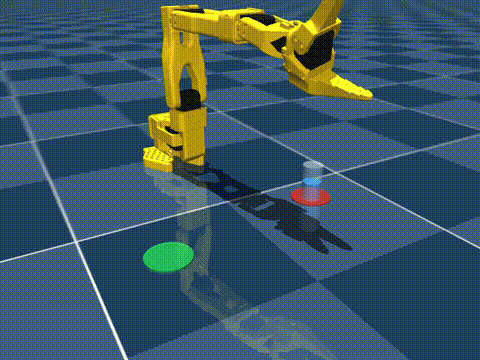
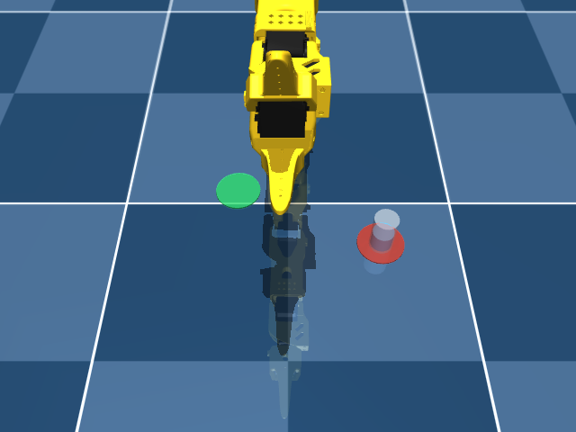
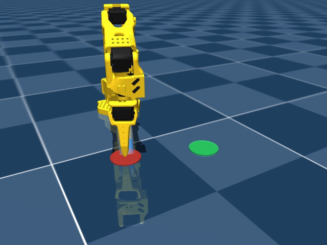
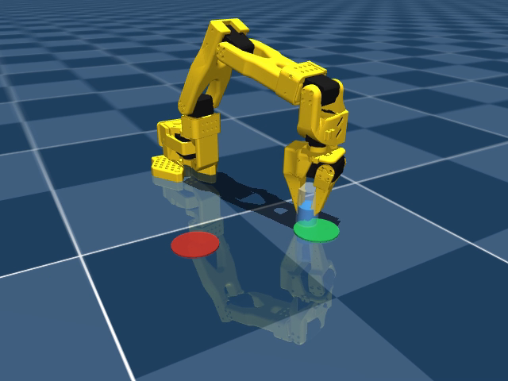

# How to train a robot arm to pick up and carry a cup (in simulation) — a hands-on guide

*A practical walkthrough of [MarcelloMorettoni/sim2real](https://github.com/MarcelloMorettoni/sim2real):
train an SO-101 arm in MuJoCo to pick a cup off a red marker and set it down upright on
a green one, watch it live, and reuse the code for your own experiments.*



## What this repo does (and honestly, what it doesn't)

**Does:**
- Simulates the [SO-101 / SO-ARM100](https://github.com/TheRobotStudio/SO-ARM100)
  low-cost arm (Feetech STS3215 servos) in MuJoCo 3, with the official model —
  plus a fix that makes its gripper actually able to grasp (see gotchas below).
- Trains two tasks with Stable-Baselines3: **reach** (move the fingertip to a target —
  simple, fully sim2real-ready) and **pick-and-place** (grasp a free-standing cup,
  carry it, place it on a goal pad).
- Treats the cup as "full of water" via a **tilt limit**: rotate it past ~30° and the
  episode fails. The trained motion is level and gentle as a result.
- Ships a working final controller for pick-and-place: a scripted approach/pickup
  primitive + a learned SAC policy for carry and set-down. **~83% task success** on
  randomized layouts in simulation.
- Includes deployment scaffolding for the real arm (servo bus driver, calibration,
  ONNX export with normalization baked in) — used by the reach task.

**Doesn't (yet):**
- No real fluid: "spilling" is a tilt threshold, not slosh — lateral acceleration is
  unconstrained. No force-controlled gripping either (the cup is rigid; a paper cup
  would be crushed). Delicate manipulation in the full sense is *not* solved here.
- The cold-start approach is scripted, not learned — 17 training runs' worth of
  evidence says everything *after first contact* trains well; the approach kept
  collapsing into avoidance (details in the [companion story](README.md)).
- Pick-and-place hasn't touched hardware yet: it needs a camera for the cup pose
  first. The numbers in this post are simulation numbers.

If that scope works for you, here's how to run everything.

---

## 1. Setup (5 minutes)

Linux + conda. A GPU helps (training was done on an RTX 4090) but small runs work on CPU.

```bash
git clone https://github.com/MarcelloMorettoni/sim2real.git
cd sim2real
make setup                 # creates the `sim2real` conda env, installs deps
conda activate sim2real
make test                  # 28 fast tests — all green means physics + envs are sane
make smoke                 # ~10 s micro-training run through the whole pipeline
```

If `make test` passes, your MuJoCo can grasp, the reward invariants hold, and the
configs round-trip. Everything below builds on that.

## 2. The task and the one config file that defines it

Pick-and-place is fully described by `configs/pickplace_sac5.yaml` (the best recipe).
The pieces worth knowing before you touch anything:

| Section | What it controls |
|---|---|
| `env.opposite_sides`, `side_min_y` | the layout: cup on a red pad one side, green goal pad on the other, random spots |
| `env.spill_tilt`, `place_tilt`, `w_upright` | the "cup of water" rules: tilt = fail, place must be upright |
| `env.*_init_prob` | **curriculum starts** — fraction of episodes that begin mid-skill (jaws around the cup / holding it / carrying it / above the goal). This is what makes the task learnable |
| `env.w_reach`, `w_contact`, `w_lift`, `w_transport`, `success_bonus` | the shaped reward. The comments in `sim2real/config.py` explain why each term is gated the way it is — change with care, every gate boundary is a potential exploit |
| `dr.*` | domain randomization (masses, friction, servo gains, latency) for sim2real robustness |
| `train.*` | algorithm (SAC), steps, exploration noise (`log_std_init`) |



## 3. Train

```bash
# pick-and-place with SAC (best recipe; ~2-4 h for 2-4M steps on a good machine)
python -m sim2real.train --config configs/pickplace_sac5.yaml --run-name my_run

# continue from an existing policy (same reward only! see gotchas)
python -m sim2real.train --config configs/pickplace_sac5.yaml --run-name my_run2 \
    --init-from outputs/my_run/final_model.zip

# the simple reach task (good first experiment, ~30 min)
make train

# watch the curves while it trains
make tb
```

Each run creates `outputs/<run-name>/` with the frozen config, TensorBoard logs,
periodic checkpoints, the best/final models and the observation-normalization stats
(needed at deploy time).

Expected trajectory for pick-and-place: skills appear **back-to-front** — first the
set-down, then carrying, then closing the gripper — as value propagates from the goal
backwards through the curriculum. Judge progress with the script below, not by eval
reward alone.

## 4. Watch and evaluate

```bash
# the full task, live window: scripted pickup + learned carry/place (~83% success)
python scripts/hybrid_pickplace.py --watch

# same thing, headless, printing success stats / recording a video
python scripts/hybrid_pickplace.py --episodes 20
python scripts/hybrid_pickplace.py --episodes 8 --video demo.mp4

# the raw learned policy on its curriculum skills (set-downs, grasps, carries)
python scripts/watch_skills.py outputs/<run>

# the raw learned policy from scratch (spoiler: it avoids the cup — that's WHY
# the hybrid exists)
make watch RUN=outputs/<run>

# plain numbers
python -m sim2real.eval --run outputs/<run> --episodes 50
```

The interactive windows need a desktop session with `MUJOCO_GL` unset; video
rendering wants `MUJOCO_GL=egl`.




## 5. The three gotchas that will bite you if you fork this

Everything here is documented at length in `docs/HOW_IT_WORKS.md` and guarded by
tests, but these three cost days and are universal to MuJoCo manipulation projects:

1. **MuJoCo collides meshes as convex hulls.** A concave gripper jaw becomes a solid
   block — the mouth of the stock SO-101 model is *sealed shut* in collision space,
   and nothing can ever be grasped. This repo rebuilds the jaw collision as fitted
   boxes at load time (`fix_gripper_collision`, on by default). If you swap in a
   different gripper or object mesh, check its hull first.
2. **Every reward gate is an exploit waiting to happen.** All-negative rewards make
   quitting optimal (the policy threw the cup away to end episodes). Lift-gated
   income makes the last 2 cm of a set-down unpayable. Ungated income pays for
   dragging the cup along the floor. Read the reward-design war stories in the docs
   before editing `_reward_and_done`.
3. **Keep curriculum out of your eval.** Training-only episode starts must be zeroed
   in evaluation envs, or your success metric silently reports curriculum wins. The
   env factory does this automatically for every `*_init_prob` field — keep the
   pattern if you add new curriculum modes.

## 6. Make it yours

- **Different object:** edit `assets/so101/pickplace_scene.xml` (the cup's size,
  mass, friction). Re-run `make test` — `test_gripper_can_hold_cup` tells you
  immediately if the new object is physically graspable.
- **Different task:** subclass `SO101MujocoBase` (see `sim2real/envs/`), implement
  five hooks, register it, add a scene and a config. The reach env is ~70 lines and
  a good template.
- **Different robot:** the collision-fix, curriculum and reward machinery are not
  SO-101-specific; you'd swap the MJCF and the joint list in `sim2real/config.py`.
- **Toward hardware:** `docs/DEPLOYMENT.md` covers servo calibration; reach deploys
  today via ONNX + the Feetech bus driver. Pick-and-place additionally needs a cup
  pose from perception (overhead camera / AprilTag) — the observation already has the
  slot for it, and the scripted approach in `scripts/hybrid_pickplace.py` is written
  as exactly the primitive you'd run from a perceived pose.

## 7. Fair benchmarks to expect

From this repo's final models, on randomized layouts, in simulation:

| Setting | Result |
|---|---|
| Hybrid full task (scripted pickup + learned carry/place) | ~83% success |
| Learned set-down, starting held above the goal | 15/15 |
| Learned carry + place, starting held aloft far from goal | ~8/15 |
| Learned grasp close, starting jaws around the cup | 15/15 holds |
| Learned everything from scratch, cold start | ~0 (it avoids the cup — see the [story](README.md)) |

If you beat that last row with pure RL, please open an issue — genuinely. The
leading candidates are an acceleration/slosh penalty (making "delicate" more real),
force-aware gripping, and longer curriculum-balanced SAC runs.

---

*MuJoCo 3 · Gymnasium · Stable-Baselines3 · pair-engineered with Claude Code.
Full debugging story: [the robot that couldn't pick up a glass](README.md).*
